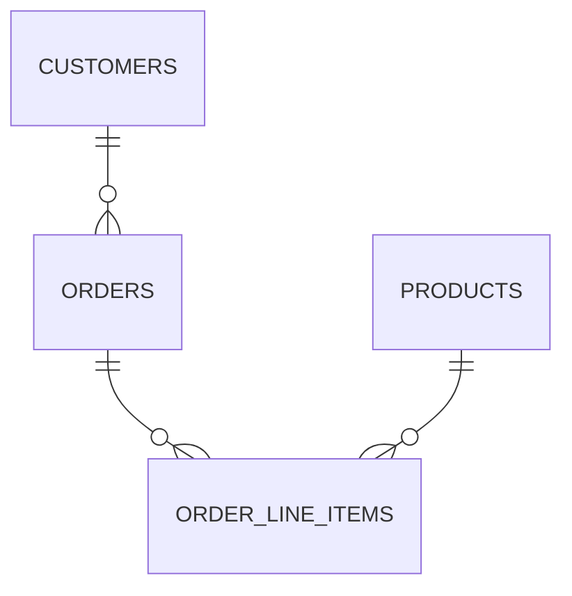
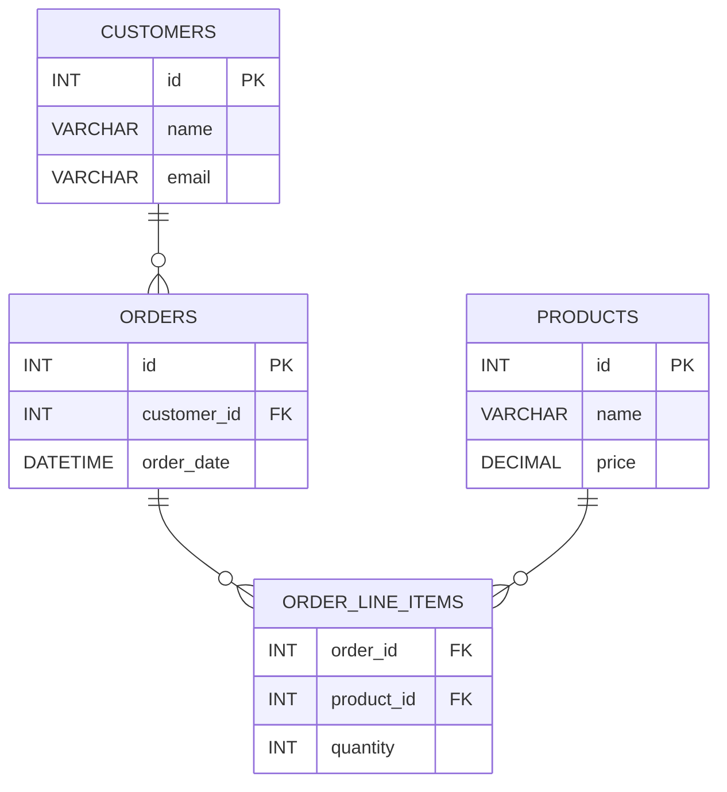
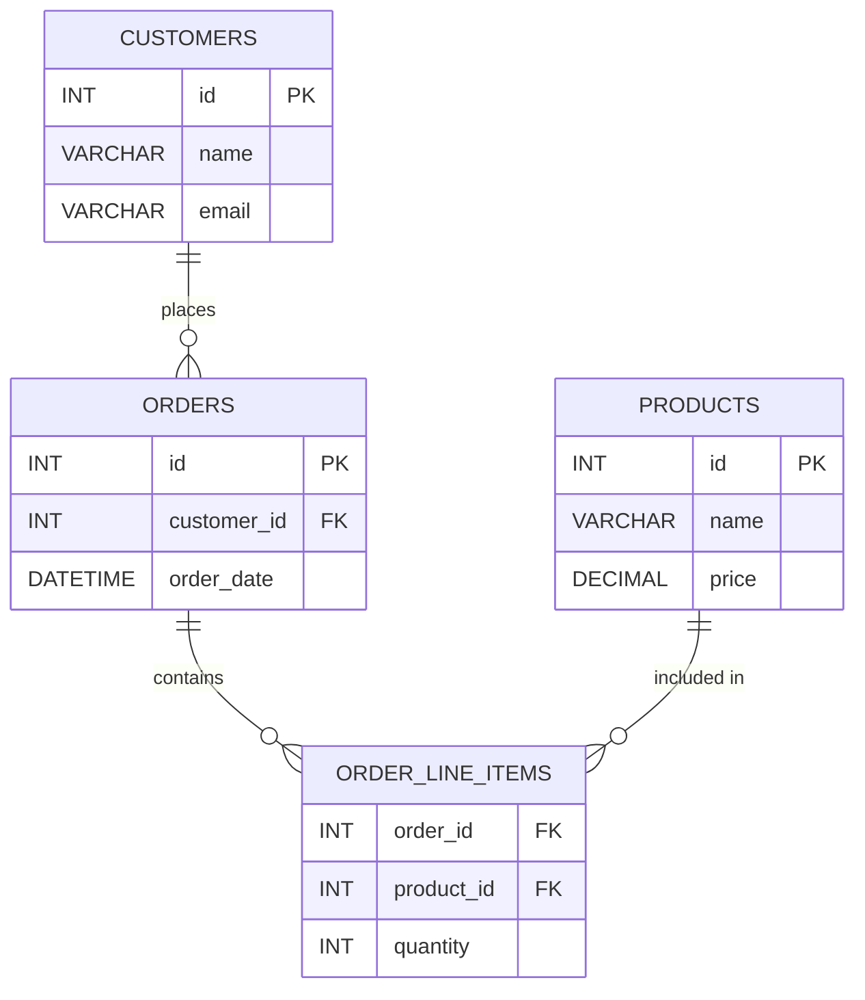

# Lesson 3: Relationships and Cardinality

## What You’ll Learn

- What cardinality means in relational databases
- The three main types of relationships: one-to-one, one-to-many, many-to-many
- How to model and enforce relationships with foreign keys
- How to design and use gerund (join) tables for many-to-many relationships
- Optional vs. mandatory participation in relationships
- Best practices and common mistakes in relationship modeling
- How to visually model your database with ERDs and Mermaid (or, you know, a napkin and a pen)

## 1. Why Relationships and Cardinality Matter

In real-world data, entities are rarely isolated.

- Customers place orders.
- Orders contain products.
- Products can appear in many orders.

**Cardinality** describes the number of possible relationships between rows in two tables.  
Understanding cardinality helps you:

- Accurately model real-world rules
- Avoid data duplication and anomalies
- Enforce business logic and data integrity

## 2. Cardinality and Participation: The Language of Relationships

**Cardinality** is a term used to describe the numerical relationship between rows in two tables.  
**Participation** describes whether the relationship is **mandatory** (must exist) or **optional** (may be null).

### Cardinality Types

- **One-to-One (1:1):** Each row in Table A relates to at most one row in Table B, and vice versa.
- **One-to-Many (1:N):** Each row in Table A can relate to many rows in Table B, but each row in Table B relates to only one row in Table A.
- **Many-to-Many (M:N):** Rows in Table A can relate to many rows in Table B, and vice versa.

### Participation: Optional vs. Mandatory

- **Mandatory Participation:**
  - The relationship **must** exist.
  - Example: Every order **must** belong to a customer (`orders.customer_id` is `NOT NULL`).
- **Optional Participation:**
  - The relationship **may** exist, but isn’t required.
  - Example: A customer **may** have a profile, but not all do (`customer_profiles.customer_id` can be `NULL`).

**How to Model in SQL:**

- Use `NOT NULL` on the foreign key column for **mandatory** participation.
- Allow `NULL` for **optional** participation.

**Example:**

```sql
-- Mandatory: Every order must have a customer
customer_id INT NOT NULL

-- Optional: A profile may or may not be linked to a customer
customer_id INT NULL
```

## 3. One-to-One Relationships (1:1 Cardinality)

### What is it?

Each row in Table A relates to one and only one row in Table B, and vice versa.

### When to Use

- To split rarely-used or sensitive data into a separate table (e.g., customer profiles, authentication info)
- To enforce that each entity has at most one related entity

### How to Model

- Place a foreign key in the child/secondary table (most common)
- Or, place a foreign key in the parent/primary table (less common)
- Always enforce uniqueness with a `UNIQUE` constraint or by making the foreign key the primary key

### Example: Customers and Profiles

**Diagram:**

```
customers
---------
id (PK)
name

customer_profiles
-----------------
profile_id (PK)
customer_id (UNIQUE, FK to customers.id)
address
phone
```

**SQL Example:**

```sql
CREATE TABLE customers (
  id INT PRIMARY KEY AUTO_INCREMENT,
  name VARCHAR(100) NOT NULL
);

CREATE TABLE customer_profiles (
  profile_id INT PRIMARY KEY AUTO_INCREMENT,
  customer_id INT UNIQUE,
  address VARCHAR(255),
  phone VARCHAR(20),
  CONSTRAINT fk_profile_customer FOREIGN KEY (customer_id) REFERENCES customers(id)
);
```

**Best Practices:**

- The foreign key typically goes on the child (secondary) table.
- Use `UNIQUE` to enforce the one-to-one rule.
- If the relationship is optional, allow the foreign key to be `NULL`.

**Pitfalls:**

- Forgetting the `UNIQUE` constraint can turn a one-to-one into a one-to-many.

## 4. One-to-Many Relationships (1:N Cardinality)

### What is it?

A row in Table A can relate to many rows in Table B, but each row in Table B relates to only one row in Table A.

### When to Use

- Most common relationship in databases.
- Examples: customers and orders, authors and books (if each book has one author), departments and employees.

### How to Model

- Place a foreign key in the "many" table, referencing the "one" table’s primary key.

### Example: Customers and Orders

**Diagram:**

```
customers
---------
id (PK)
name

orders
------
id (PK)
order_date
customer_id (FK to customers.id)
```

**SQL Example:**

```sql
CREATE TABLE customers (
  id INT PRIMARY KEY AUTO_INCREMENT,
  name VARCHAR(100) NOT NULL
);

CREATE TABLE orders (
  id INT PRIMARY KEY AUTO_INCREMENT,
  order_date DATETIME DEFAULT CURRENT_TIMESTAMP,
  customer_id INT NOT NULL,
  CONSTRAINT fk_order_customer FOREIGN KEY (customer_id) REFERENCES customers(id)
);
```

**Best Practices:**

- Always use a foreign key to enforce the relationship.
- Index the foreign key column for performance.

**Pitfalls:**

- Not enforcing the foreign key allows orphaned records (e.g., orders with no customer).

## 5. Many-to-Many Relationships (M:N Cardinality) and Gerund Tables

### What is it?

Rows in Table A can relate to many rows in Table B, and vice versa.

### Why Not Just Use Foreign Keys?

- You can’t put a list of foreign keys in a single column.
- You need a separate table to represent the relationship.

### Gerund (Join) Table

- A table whose sole purpose is to connect two other tables.
- Contains at least two foreign keys, each referencing one of the related tables.
- The combination of these foreign keys is usually the primary key of the join table.

### Example: Orders and Products

**Diagram:**

```
orders
------
id (PK)
order_date

products
--------
id (PK)
name
price

order_line_items
--------------
order_id (FK to orders.id)
product_id (FK to products.id)
quantity
PRIMARY KEY (order_id, product_id)
```

**SQL Example:**

```sql
CREATE TABLE orders (
  id INT PRIMARY KEY AUTO_INCREMENT,
  order_date DATETIME DEFAULT CURRENT_TIMESTAMP
);

CREATE TABLE products (
  id INT PRIMARY KEY AUTO_INCREMENT,
  name VARCHAR(100) NOT NULL,
  price DECIMAL(10,2) NOT NULL
);

CREATE TABLE order_line_items (
  order_id INT NOT NULL,
  product_id INT NOT NULL,
  quantity INT NOT NULL,
  PRIMARY KEY (order_id, product_id),
  CONSTRAINT fk_op_order FOREIGN KEY (order_id) REFERENCES orders(id),
  CONSTRAINT fk_op_product FOREIGN KEY (product_id) REFERENCES products(id)
);
```

**Best Practices:**

- Use a composite primary key to prevent duplicate relationships.
- Name your foreign key constraints for clarity.
- If you need to store extra info about the relationship (e.g., quantity), add columns to the join table.

**Pitfalls:**

- Storing lists or comma-separated values in a single column instead of using a join table.
- Forgetting to enforce foreign keys, leading to invalid relationships.

## 6. Foreign Keys: The Glue of Relationships

- Foreign keys enforce referential integrity: you can’t reference a row that doesn’t exist.
- You can name your foreign key constraints for clarity and easier maintenance.
- Foreign keys can have options like `ON DELETE CASCADE` or `ON UPDATE SET NULL` to control what happens when related data changes.

**Example:**

```sql
ALTER TABLE order_line_items
  ADD CONSTRAINT fk_op_order FOREIGN KEY (order_id) REFERENCES orders(id) ON DELETE CASCADE,
  ADD CONSTRAINT fk_op_product FOREIGN KEY (product_id) REFERENCES products(id) ON DELETE CASCADE;
```

**Best Practices:**

- Use `ON DELETE CASCADE` with caution—deleting a parent will delete all related children.
- Use `ON DELETE SET NULL` if you want to keep the child but remove the relationship.

**Pitfalls:**

- Not naming constraints makes them harder to drop or debug.
- Not understanding cascading effects can lead to accidental data loss.

## 7. Visually Modeling Database Entities

### What is an ERD?

An **Entity-Relationship Diagram (ERD)** is a visual representation of your database structure.

- **Entities** are tables (e.g., customers, orders, products).
- **Relationships** show how tables are connected (e.g., a customer can have many orders; an order can have many products).
- ERDs help you plan, communicate, and understand your database design.

### Why Use ERDs?

- **Clarity:** See how tables connect at a glance.
- **Collaboration:** Share your design with teammates or instructors.
- **Validation:** Spot design issues (like missing relationships or redundant data) before you write SQL.
- **And if all else fails, you can always draw it on a napkin. (Seriously, it works!)**

### Quick Overview: Mermaid ERD Syntax

Mermaid makes it easy to draw ERDs in Markdown. Here’s a quick reference for the syntax:

- **Entities (Tables):**
  ```mermaid
  erDiagram
      CUSTOMERS {
          INT id PK
          VARCHAR name
      }
  ```
- **Relationships:**
  - `||` = exactly one (mandatory, PK side)
  - `|o` = zero or one (optional, PK side)
  - `o|` = zero or one (optional, FK side)
  - `o{` = zero or more (optional, FK side)
  - `|{` = one or more (mandatory, FK side)
  - `}` = many

**Examples:**

- **One-to-Many (Mandatory):**  
  `CUSTOMERS ||--o{ ORDERS : ""`  
  (Each order must have a customer; a customer can have many orders.)

- **One-to-Many (Optional):**  
  `CUSTOMERS ||--o| ORDERS : ""`  
  (Each order may or may not have a customer.)

- **One-to-One (Mandatory on both sides):**  
  `CUSTOMERS ||--|| CUSTOMER_PROFILES : ""`

- **One-to-One (Optional):**  
  `CUSTOMERS ||--|o CUSTOMER_PROFILES : ""`  
  (A customer may or may not have a profile.)

- **Many-to-Many:**  
  `ORDERS ||--o{ ORDER_LINE_ITEMS : ""`  
  `PRODUCTS ||--o{ ORDER_LINE_ITEMS : ""`

### ERD Example: Customers, Orders, Products, and Order_Line_Items

#### A. **Simplified ERD (Only Table Names and Relationships)**



#### B. **Detailed ERD (Including Fields)**



### How to Use Mermaid for ERDs

- You can visualize your ERDs using the [Mermaid Playground](https://www.mermaidchart.com/play).
- Paste the Mermaid code blocks from this lesson into the editor to see your diagrams instantly.
- You can also tweak the code and see changes live.
- Or, if you’re feeling old-school, sketch it out by hand—sometimes a napkin is all you need!

### Expanding Your ERD

As your schema grows, you can add more entities and relationships. For example, you might add a `payments` table, a `shipping_addresses` table, or a `reviews` table.

### Best Practices

- Use ERDs early in your design process.
- Start simple (just table names and relationships), then add fields as your design matures.
- Keep your ERDs up to date as your schema evolves.

**Try It Yourself:**

- Draw an ERD for your own database project using Mermaid.
- Start with just the tables and relationships, then add fields and keys.
- Use the [Mermaid Playground](https://www.mermaidchart.com/play) to write and preview your ERD before submitting.
- Or, you know, just draw it—sometimes the best ideas start with a pen and paper.

## 8. Practical Example: Modeling and Implementing Relationships

Let’s put everything together with a practical example for our store.

### Step 1: Draw the ERD

**ERD for Customers, Orders, Products, and Order_Line_Items (with fields):**



- You can preview this diagram in the [Mermaid Playground](https://www.mermaidchart.com/play).
- Notice the relationship labels ("places", "contains", "included in")—these are optional but can make your ERD more descriptive.

### Step 2: Create the Tables and Relationships in SQL

```sql
CREATE TABLE customers (
  id INT PRIMARY KEY AUTO_INCREMENT,
  name VARCHAR(100) NOT NULL,
  email VARCHAR(100) NOT NULL UNIQUE
);

CREATE TABLE orders (
  id INT PRIMARY KEY AUTO_INCREMENT,
  customer_id INT NOT NULL,
  order_date DATETIME DEFAULT CURRENT_TIMESTAMP,
  CONSTRAINT fk_order_customer FOREIGN KEY (customer_id) REFERENCES customers(id)
);

CREATE TABLE products (
  id INT PRIMARY KEY AUTO_INCREMENT,
  name VARCHAR(100) NOT NULL,
  price DECIMAL(10,2) NOT NULL
);

CREATE TABLE order_line_items (
  order_id INT NOT NULL,
  product_id INT NOT NULL,
  quantity INT NOT NULL,
  PRIMARY KEY (order_id, product_id),
  CONSTRAINT fk_op_order FOREIGN KEY (order_id) REFERENCES orders(id),
  CONSTRAINT fk_op_product FOREIGN KEY (product_id) REFERENCES products(id)
);
```

- Here, we explicitly name our foreign key constraints (e.g., `fk_order_customer`, `fk_op_order`, `fk_op_product`).  
  **Naming relationships/constraints is not required, but it’s a best practice for clarity and easier maintenance.**

## 9. Best Practices and Common Pitfalls

- Always use foreign keys to enforce relationships, not just for documentation.
- Name your constraints for easier debugging and maintenance—even though it’s not required, it helps a lot!
- Use composite primary keys in join tables to prevent duplicate relationships.
- Avoid storing lists or comma-separated values in a single column.
- Be careful with cascading deletes—make sure you understand the impact.
- Index foreign key columns for performance.

## 10. Recap

- **Cardinality** describes the number of possible relationships between rows in two tables.
- One-to-one, one-to-many, and many-to-many are the core relationship types in relational databases.
- Gerund (join) tables are essential for many-to-many relationships.
- Foreign keys are the backbone of data integrity.
- ERDs help you visualize and communicate your design.
- Naming your relationships/constraints is a best practice, even if not required.

## 11. Next Steps

You’ve completed the lesson on relationships and cardinality!  
To reinforce what you’ve learned, complete the homework assignment for this lesson.

**➡️ [Go to Homework 3: Relationships and Cardinality](../homework/hw3.md)**

If you have questions or want to try more examples, feel free to experiment with your tables or ask for help.
